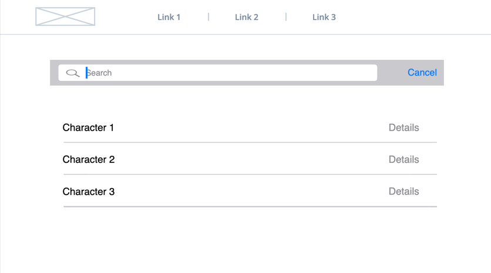

# FlightHub Developer Aptitude Test

This repo is served to provide code to potential FlightHub candidates used to properly complete the Aptitude Test for Backend and Full-Stack developers.

## Instructions

You are provided two APIs that provide pre-populated information:

- Star Wars API (https://swapi.dev/documentation)
- Game Of Thrones API (https://anapioficeandfire.com/documentation)

Using the APIs above, you are required to produce an endpoint that presents the information specified.

### Requirements

1. The integration must reside in the code provided. You may create or extend any additional classes and files if needed. The code provides a pre-populated endpoint (`/people`) which you will use to add the missing information.

2. Both Source API results must be combined to result into a single standardized collection of entities.

### How to run the provided code

1. Before starting, make sure your environment has the following distributions installed:

- PHP (7.4 or higher)
- composer (https://getcomposer.org/)

2. Install the dependencies by running `composer install`

3. From your terminal, change directories to `/public` and run the following: `php -S localhost:8080` (Note: If port `8080` is already used, feel free to open it at another port)

4. From then on, you should be able to access the API from the following address: `localhost:8080/people`

## Models Included

### `Character`

- A character is a person that is featured in a Movie or a Book (e.g Jon Snow, Luke Skywalker, etc.)

- A character always provides the following information:

    - Name (`name`)
    - Gender (`gender`)
    - In what work he appeared in (`appearedIn`)

- Depending on the origin of the character, some information differ:
    - If it is a Star Wars character, we will get information on his vehicles and starships
    - If it is a Game Of Thrones Characters, we will get information on his allegiances and aliases

## Endpoints

### - `/`

Returns the HTML file found inside `public/html/index.html`. You may customize the code there to display your frontend implementation.

If you wish to use a separate implementation (e.g `create-react-app`), You can omit using this endpoint and provide a second repo for your frontend implementation.

### - `/people`

Returns a combined collection of `Character`. The information can also be filtered by sending a `name` parameter in the query string

#### Expected Result

Running `localhost:8080/people` should return the following:


```json
[
    {
        "name": "Luke Skywalker",
        "gender": "male",
        "appearedIn": [
            "http://swapi.dev/api/films/1/",
            "http://swapi.dev/api/films/2/",
            "http://swapi.dev/api/films/3/",
            "http://swapi.dev/api/films/6/"
        ],
        "allegiances": [
            "http://swapi.dev/api/starships/12/",
            "http://swapi.dev/api/starships/22/"
        ],
        "aliases": [
            "http://swapi.dev/api/vehicles/14/",
            "http://swapi.dev/api/vehicles/30/"
        ]
    },
    /* more sw characters...*/
    {
      "name": "Walder",
      "gender": "Male",
      "appearedIn": [
        "https://anapioficeandfire.com/api/books/1",
        "https://anapioficeandfire.com/api/books/2",
        "https://anapioficeandfire.com/api/books/3",
        "https://anapioficeandfire.com/api/books/5",
        "https://anapioficeandfire.com/api/books/8"
      ],
      "allegiances": [
        "Hodor"
      ],
      "aliases": [
        "https://anapioficeandfire.com/api/houses/362"
      ]
    },
    /* more got characters...*/
]
```
Running `localhost:8080/people?name=luke` should return the following:

```json
[
    {
        "name": "Luke Skywalker",
        "gender": "male",
        "appearedIn": [
            "http://swapi.dev/api/films/1/",
            "http://swapi.dev/api/films/2/",
            "http://swapi.dev/api/films/3/",
            "http://swapi.dev/api/films/6/"
        ],
        "allegiances": [
            "http://swapi.dev/api/starships/12/",
            "http://swapi.dev/api/starships/22/"
        ],
        "aliases": [
            "http://swapi.dev/api/vehicles/14/",
            "http://swapi.dev/api/vehicles/30/"
        ]
    }
]
```

Running `localhost:8080/people?name=jon+snow` should return the following:

```json
[
    {
        "name": "Jon Snow",
        "gender": "Male",
        "appearedIn": [
            "https://anapioficeandfire.com/api/books/5"
        ],
        "allegiances": [
            "Lord Snow",
            "Ned Stark's Bastard",
            "The Snow of Winterfell",
            "The Crow-Come-Over",
            "The 998th Lord Commander of the Night's Watch",
            "The Bastard of Winterfell",
            "The Black Bastard of the Wall",
            "Lord Crow"
        ],
        "aliases": [
            "https://anapioficeandfire.com/api/houses/362"
        ]
    }
]
```

## Frontend UI

A frontend application should be included to supply the user an interface to interact with the endpoint

The following requirements need to be fulfilled:

- A user can view all characters
- A user can search a character by its name

In addition, **the UI must be created as a no-refresh Single-Page Application**. The use of a JS framework (ReactJS, Vue.JS, Angular, etc) is encouraged.

At a minimum, the page requires to add the following components:

- A search bar
- A list of all characters

Design choices are left to your discretion, so be creative! Below is a picture of what it may look in the end if you need some pointers:



## Assessment Goals

We will evaluate the assessment based on the following criterias:

- Code Style (Consistent naming convention, organization of functions and classes)
- MVC Concepts
- Code functionality (presence of any bugs, or defects in one of the cases specified)
- Code performance (Lengthy response time, Presence of O(n^2), anti-patterns)

Although it is not a requirement, the following are also taken into consideration:

- Documentation and presence of comments.
- Presentation of the UI.

## Final Notes

There is typically **no time limit** for this test to be handed back, so you can take your time to pay attention to detail in order to return a quality work!

Happy coding!


